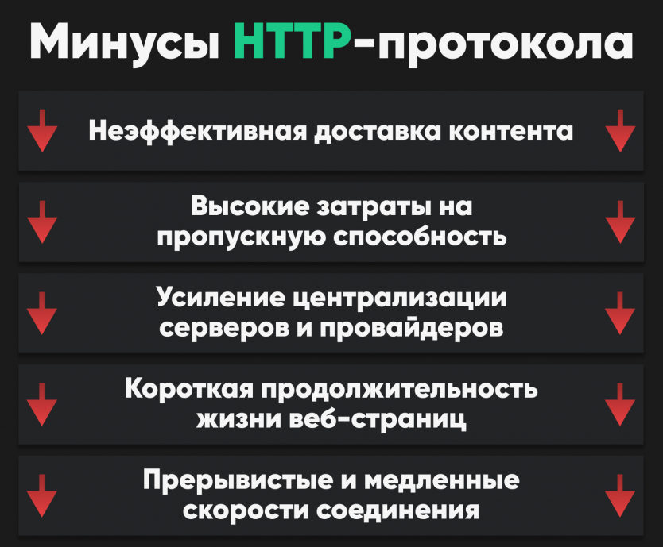
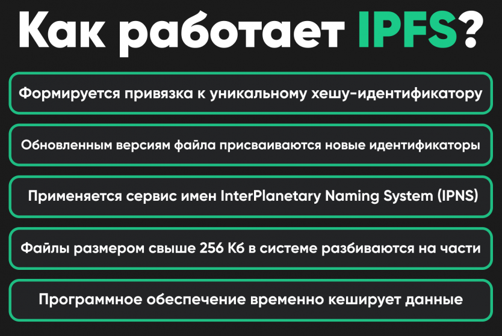

.  
# IPFS
IPFS with Ethereum based file blockchain

## IPFS
### Введение
На данный момент главный интернет протокол является HTTP. Но по мнению аналитиков его время проходит. Одна из потенциально перспективных новых технологий — IPFS, технически и концептуально сложный протокол, призванный поднять на новый уровень обмен данными через интернет.  

### Для чего нужен IPFS?
Сокращение IPFS расшифровывается как Межпланетная файловая система. IPFS иными словами — это открытый одноранговый распределенный гипермедиа-протокол с открытым исходным кодом, который работает как повсеместная файловая система для всех вычислительных устройств.  

### Какие проблемы есть у HTTP?
HTTP был изобретен в 1991 г., принят веб-браузерами в 1996 г., именно он определяет способы передачи сообщений через интернет, а также реакцию браузеров на команды и механизмы обработки запросов серверами. По сути, это базовый сетевой протокол и основа протокола парадигмы клиент-сервер.
Типичные проблемы современного HTTP-протокола — это неэффективная доставка контента из-за одновременной загрузки файлов с одного сервера, высокие затраты на пропускную способность и дублирование файлов, требующие все больших и больших объемов информации для хранения. Более того, усиление централизации серверов и провайдеров ведет к усилению интернет-цензуры.  

 

### Что предлагает IPFS?
В пику устаревшему протоколу IPFS предоставляет в распоряжение пользователей распределенное бесплатное хранилище файлов. Файлы распространяются по протоколу на основе BitTorrent. Важно отметить, что IPFS выступает в качестве своего рода комбинации Kodemila, BitTorrent и Git для создания распределенной подсистемы интернета.
Каждому файлу и всем блокам в нем присваивается уникальный идентификатор, который представляет собой криптографический хеш. Дубликаты удаляются по сети, а история версий отслеживается для каждого файла. Это приводит к постоянному доступу контента, где веб-страницы не исчезают из-за сбоя сервера или банкротства веб-хостинга.
Кроме того, подлинность контента гарантируется с помощью этого механизма, и при поиске файлов вы по существу просите сеть найти узлы, хранящие контент за уникальным идентифицирующим хешем, связанным с этим контентом.

### Как работает IPFS?
Вместо загрузки файлов с отдельных серверов, в IPFS запрашиваются одноранговые узлы в сети, и они указывают путь к конкретному файлу, а не обращаются к центральному серверу, снижая нагрузку на него. Это позволяет осуществлять распределение больших объемов данных с высокой эффективностью.
При загрузке информации в IPFS адрес для доступа к объекту, файлу или пользовательским данным в системе формируется с привязкой не к серверу, а к его уникальному криптографическому хешу-идентификатору.  

  

При повторной загрузке файла CID не изменяется, а обновленным версиям файла присваиваются новые хеш-идентификаторы. Чтобы получившие доступ к ранней версии файла пользователи могли иметь его и к более поздним вариантам, применяется сервис имен InterPlanetary Naming System (IPNS) — аналог DNS в традиционном Интернете.
Файлы размером свыше 256 Кб в системе разбиваются на части, хешируются и организовываются в IPLD-объекты (InterPlanetary Linked Data), состоящие из двух компонентов: самих данных и ссылок на части файла, связанных между собой.
Затем отвечающее за коммуникации в системе программное обеспечение временно кеширует данные либо по выбору пользователя «прикрепляет» (pin) их к себе на постоянной основе и по запросу раздает их другим узлам. Такие узлы могут выполнять функции провайдеров контента или остаться его получателями.
После запроса контента в распределенной хеш-таблице (Distributed Hash Table, DHT) системы проводится поиск ближайших к пользователю узлов с копией данных — и именно они отдают части файла.

### Зачем использовать IPFS в связке с Ethereum?
Любой сколько-нибудь объемный контент сохранять на блокчейне слишком дорого и вредно для сети. Поэтому самый оптимальный вариант — это сохранение какой-нибудь ссылки на файл, лежащий в офф-чейн хранилище, не обязательно именно IPFS. Но у IPFS есть ряд преимуществ:

Ссылка на файл — это хеш, уникальный для конкретного содержимого файла, поэтому если мы положим этот хеш на блокчейн, то можем быть уверены, что получаемый по нему файл именно тот, который изначально и добавлялся, файл невозможно подменить
Распределенная система страхует от недоступности конкретного сервера (из-за блокировки или других причин)
Ссылка на файл и хеш-подтверждение объединены в одну строку, значит можно меньше записывать в блокчейн и экономить газ

Среди недостатков можно упомянуть, что раз центрального сервера нет, то для доступности файлов необходимо, чтобы хотя бы кто-то один этот файл “раздавал”. 

### Пример использования IPFS
(Данный репозиторий) https://github.com/PushinSt/File-blockchain---IPFS демонстрирует работу с протоколом IPFS и предлагает простой пример, как его можно использовать в связке с блокчейном. 

#### IPFS 
Установка и запуск:  
Необходимо установить IPFS client (https://ipfs.tech/#install)  
`git clone`  
`npm install`  
`npm run start:dev`  


Далее с помощью **post** запроса можно добавить файл в сеть IPFS:  
`Адрес: http://localhost:3000/getFile/`  
```
Body:
{
		"path": "message.txt",
		"content": "postman says whassup!"
}
```
path - Название файла;  
content - Содержимое файла (Если файл с названием path существует в директории files/send, то содержимое игнорируется).  
Файлы загружаются некоторое время (У меня получалось около 5 минут).  

С помощью **get** запроса можно получить файл из сети IPFS:  
`Адрес: http://localhost:3000/getFile/nameFile/cid`  
nameFile - имя файла для сохранения на компьютере в папке files/get;  
cid - хэш файла в сети IPFS.  

Пример файла, загруженного в сеть IPFS (Может быть недоступно, если у меня будет отключен клиент IPFS или я удалю данный файл):  
https://ipfs.io/ipfs/QmQy4HN59MbHfFz66n7s5RpimMrd29MgJNcPszsmkd8knR?filename=ipfs.jpg  
#### Ethereum
Идея использования блокчейна состоит в том, чтобы хранить в смарт-контракте cid файла. Тем самым полагаясь на достоверность блокчейна мы можем доверять содержимому файла. В примере представлен простой пример смарт-контрата на языке Solidity, который сохраняет хэш (cid) файла. 
